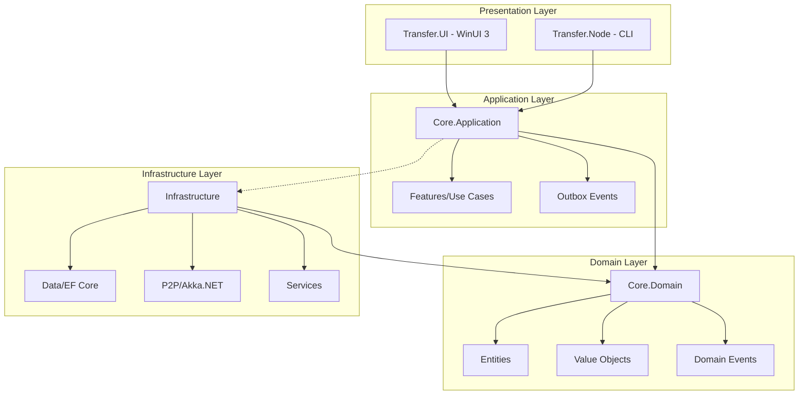
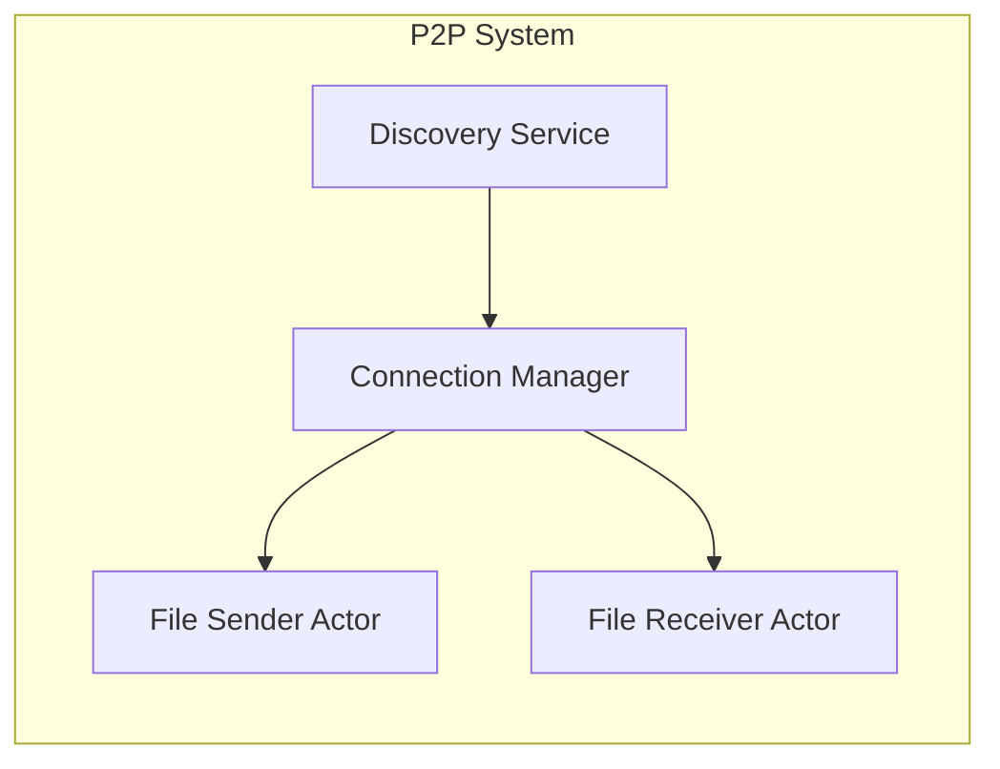
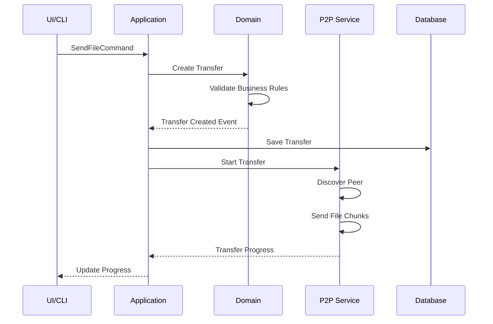
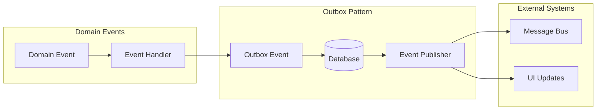

# WeTransfer P2P - Architecture Documentation

## 📋 Índice

1. [Visão Geral](#visão-geral)
2. [Princípios Arquiteturais](#princípios-arquiteturais)
3. [Estrutura de Camadas](#estrutura-de-camadas)
4. [Componentes Principais](#componentes-principais)
5. [Fluxo de Dados](#fluxo-de-dados)
6. [Tecnologias Utilizadas](#tecnologias-utilizadas)
7. [Decisões Arquiteturais](#decisões-arquiteturais)
8. [Padrões e Convenções](#padrões-e-convenções)
9. [Guia de Implementação](#guia-de-implementação)
10. [Exemplos de Código](#exemplos-de-código)

## 🎯 Visão Geral

O WeTransfer P2P é uma aplicação de transferência de arquivos peer-to-peer construída seguindo os princípios da Clean Architecture e Domain-Driven Design (DDD). A aplicação permite transferências diretas entre dispositivos sem necessidade de servidor central, com foco em segurança, performance e experiência do usuário.

### Objetivos Principais

- **Descentralização**: Transferências diretas P2P sem servidor intermediário
- **Segurança**: Criptografia end-to-end para todas as transferências
- **Performance**: Otimização para transferências de arquivos grandes
- **Multiplataforma**: Suporte para Windows, com potencial expansão futura
- **Experiência do Usuário**: Interface intuitiva e moderna com WinUI 3

## 🏗️ Princípios Arquiteturais

### 1. Clean Architecture
- **Independência de Frameworks**: O domínio não depende de tecnologias específicas
- **Testabilidade**: Todas as camadas são testáveis isoladamente
- **Independência de UI**: A lógica de negócio não conhece detalhes de apresentação
- **Independência de Banco de Dados**: Abstrações permitem trocar o mecanismo de persistência

### 2. Domain-Driven Design (DDD)
- **Ubiquitous Language**: Linguagem comum entre desenvolvedores e domínio
- **Bounded Contexts**: Separação clara de contextos (Transfer, P2P, UI)
- **Aggregates**: Transfer como aggregate root principal
- **Value Objects**: FileHash, PeerId, TransferSpeed encapsulam conceitos

### 3. SOLID Principles
- **Single Responsibility**: Cada classe tem uma única razão para mudar
- **Open/Closed**: Extensível sem modificação do código existente
- **Liskov Substitution**: Interfaces bem definidas e intercambiáveis
- **Interface Segregation**: Interfaces específicas e coesas
- **Dependency Inversion**: Dependências apontam para abstrações

### 4. Event-Driven Architecture
- **Domain Events**: Notificações de mudanças no domínio
- **Outbox Pattern**: Garantia de entrega de eventos externos
- **Actor Model**: Akka.NET para gerenciamento de concorrência P2P

## 📁 Estrutura de Camadas



### 1. Core.Domain (Camada de Domínio)

**Responsabilidades:**
- Entidades de negócio (Transfer, File, Peer)
- Value Objects (FileHash, PeerId, TransferSpeed)
- Eventos de domínio
- Interfaces de serviços de domínio
- Exceções de domínio

**Características:**
- 100% pura (sem dependências externas)
- Contém toda a lógica de negócio
- Imutabilidade onde possível

### 2. Core.Application (Camada de Aplicação)

**Responsabilidades:**
- Casos de uso (Commands/Queries)
- DTOs de aplicação
- Interfaces de infraestrutura (Ports)
- Mapeamentos DTO ↔ Domain
- Outbox Events
- Comportamentos transversais (logging, validação)

**Padrões:**
- CQRS com MediatR
- Feature Folders
- FluentValidation
- AutoMapper

### 3. Infrastructure (Camada de Infraestrutura)

**Responsabilidades:**
- Implementação de repositórios
- Contexto do banco de dados (EF Core)
- Serviços P2P (Akka.NET)
- Serviços externos (criptografia, compressão)
- Implementação de domain services
- Serialização de mensagens

**Componentes:**
- **Data**: Persistência com EF Core e SQLite
- **P2P**: Actors, Discovery, Protocol
- **Services**: Implementações concretas

### 4. Presentation (Camadas de Apresentação)

#### Transfer.UI (WinUI 3)
- MVVM com CommunityToolkit.Mvvm
- ViewModels e Views
- Serviços de UI (Navigation, Dialog)
- Adapters para conversão DTO ↔ ViewModel

#### Transfer.Node (Console)
- CLI com System.CommandLine
- Hosted Services
- Configuração via appsettings.json

## 🔧 Componentes Principais

### 1. Sistema P2P



**Discovery Service**: Localiza peers na rede usando mDNS/DHT
**Connection Manager**: Gerencia conexões ativas
**File Transfer Actors**: Gerenciam envio/recebimento com Akka.NET

### 2. Protocolo de Transferência

```protobuf
// Mensagens principais do protocolo
message FileChunk {
    string transfer_id = 1;
    uint32 chunk_number = 2;
    bytes data = 3;
    string checksum = 4;
}
```

### 3. Unit of Work Pattern

```csharp
public interface IUnitOfWork
{
    IFileRepository Files { get; }
    ITransferRepository Transfers { get; }
    Task<int> SaveChangesAsync();
    Task BeginTransactionAsync();
    Task CommitTransactionAsync();
}
```

## 🔄 Fluxo de Dados

### Fluxo de Envio de Arquivo



### Event Flow



## 🛠️ Tecnologias Utilizadas

### Core
- **.NET 9.0**: Framework principal
- **C# 13**: Linguagem com features modernas

### Domain & Application
- **MediatR**: Implementação de CQRS
- **FluentValidation**: Validação de comandos
- **AutoMapper**: Mapeamento objeto-objeto

### Infrastructure
- **Entity Framework Core 9**: ORM
- **SQLite**: Banco de dados local
- **Akka.NET**: Actor model para P2P
- **Serilog**: Logging estruturado
- **gRPC/Protobuf**: Serialização de mensagens

### Presentation
- **WinUI 3**: Framework de UI moderna
- **CommunityToolkit.Mvvm**: MVVM helpers
- **System.CommandLine**: CLI parsing

### Testing
- **xUnit**: Framework de testes
- **FluentAssertions**: Assertions expressivas
- **Moq**: Mocking framework
- **TestContainers**: Testes de integração

## 📐 Decisões Arquiteturais

### 1. Por que Clean Architecture?

**Problema**: Aplicações monolíticas com alto acoplamento
**Decisão**: Clean Architecture com DDD
**Benefícios**:
- Testabilidade completa
- Independência de frameworks
- Facilidade de manutenção
- Evolução incremental

### 2. Por que Akka.NET para P2P?

**Problema**: Gerenciamento complexo de concorrência em P2P
**Decisão**: Actor Model com Akka.NET
**Benefícios**:
- Isolamento de estado
- Resiliência built-in
- Escalabilidade horizontal
- Supervisão hierárquica

### 3. Por que Outbox Pattern?

**Problema**: Garantir consistência entre domínio e eventos externos
**Decisão**: Outbox Pattern com polling
**Benefícios**:
- Garantia de entrega
- Consistência transacional
- Rastreabilidade de eventos

### 4. Por que gRPC/Protobuf?

**Problema**: Serialização eficiente e versionável
**Decisão**: Protocol Buffers com contratos
**Benefícios**:
- Performance superior
- Contratos versionáveis
- Interoperabilidade
- Documentação automática

### 5. Por que SQLite?

**Problema**: Necessidade de banco local sem instalação
**Decisão**: SQLite embedded
**Benefícios**:
- Zero configuração
- Portabilidade total
- Performance adequada
- Backup simples

## 📋 Padrões e Convenções

### Estrutura de Pastas

```
FeatureName/
├── Command.cs      // Comando/Query
├── Handler.cs      // Handler do MediatR
├── Validator.cs    // Validador FluentValidation
└── Dto.cs         // DTOs específicos
```

### Nomenclatura

- **Entities**: Substantivos no singular (Transfer, File)
- **Value Objects**: Conceitos descritivos (FileHash, TransferSpeed)
- **Commands**: Verbo + Substantivo + Command (SendFileCommand)
- **Events**: Substantivo + Verbo Passado + Event (TransferCompletedEvent)
- **Interfaces**: Prefixo "I" (IFileRepository)

### Convenções de Código

```csharp
// Domain Event
public record TransferStartedEvent : BaseDomainEvent
{
    public string TransferId { get; init; }
    public string FileName { get; init; }
    public override string EventType => "TransferStarted";
}

// Value Object
public record FileHash
{
    public string Value { get; }
    
    public FileHash(string value)
    {
        if (string.IsNullOrWhiteSpace(value))
            throw new ArgumentException("File hash cannot be empty");
            
        Value = value;
    }
}

// Feature Handler
public class Handler : IRequestHandler<SendFileCommand, Result<TransferDto>>
{
    private readonly IUnitOfWork _unitOfWork;
    private readonly IP2PService _p2pService;
    
    public async Task<Result<TransferDto>> Handle(
        SendFileCommand request, 
        CancellationToken cancellationToken)
    {
        // Implementation
    }
}
```

## 🚀 Guia de Implementação

### 1. Configuração Inicial

```bash
# Clonar repositório
git clone https://github.com/your-repo/we-transfer-p2p.git

# Restaurar pacotes
dotnet restore

# Aplicar migrações
dotnet ef database update -p src/Infrastructure -s src/Transfer.Node

# Executar testes
dotnet test
```

### 2. Adicionando Nova Feature

1. **Criar Command/Query** em `Core.Application/Features/[FeatureName]/`
2. **Implementar Handler** com lógica de negócio
3. **Adicionar Validator** se necessário
4. **Criar DTOs** específicos da feature
5. **Registrar no DI** se necessário
6. **Adicionar testes** unitários e de integração

### 3. Estrutura de Testes

```
tests/
├── Unit/
│   ├── Domain/         # Testes de entidades e VOs
│   ├── Application/    # Testes de handlers
│   └── Infrastructure/ # Testes de serviços
└── Integration/
    ├── P2P/           # Testes de rede
    └── Database/      # Testes de persistência
```

### 4. Debugging P2P

```csharp
// Habilitar logs detalhados do Akka
var config = ConfigurationFactory.ParseString(@"
    akka {
        loglevel = DEBUG
        actor.debug.receive = on
        actor.debug.lifecycle = on
    }
");
```

## 📝 Exemplos de Código

### Criando um Novo Comando

```csharp
// Command
public record CreateTransferCommand : IRequest<Result<TransferDto>>
{
    public string FilePath { get; init; }
    public string TargetPeerId { get; init; }
}

// Handler
public class CreateTransferHandler : IRequestHandler<CreateTransferCommand, Result<TransferDto>>
{
    private readonly IUnitOfWork _unitOfWork;
    private readonly IMapper _mapper;
    
    public async Task<Result<TransferDto>> Handle(
        CreateTransferCommand request,
        CancellationToken cancellationToken)
    {
        // Criar entidade
        var transfer = Transfer.Create(
            new File(request.FilePath),
            new PeerId(request.TargetPeerId)
        );
        
        // Salvar
        _unitOfWork.Transfers.Add(transfer);
        await _unitOfWork.SaveChangesAsync(cancellationToken);
        
        // Retornar DTO
        return Result.Success(_mapper.Map<TransferDto>(transfer));
    }
}

// Validator
public class CreateTransferValidator : AbstractValidator<CreateTransferCommand>
{
    public CreateTransferValidator()
    {
        RuleFor(x => x.FilePath)
            .NotEmpty()
            .Must(File.Exists)
            .WithMessage("File must exist");
            
        RuleFor(x => x.TargetPeerId)
            .NotEmpty()
            .Length(36); // GUID length
    }
}
```

### Implementando um Actor P2P

```csharp
public class FileSenderActor : ReceiveActor
{
    private readonly ILogger<FileSenderActor> _logger;
    
    public FileSenderActor(ILogger<FileSenderActor> logger)
    {
        _logger = logger;
        
        Receive<SendFileMessage>(HandleSendFile);
        Receive<ChunkAcknowledged>(HandleChunkAck);
    }
    
    private void HandleSendFile(SendFileMessage message)
    {
        _logger.LogInformation("Starting file transfer {TransferId}", message.TransferId);
        
        // Implementar lógica de envio
        var chunks = SplitFileIntoChunks(message.FilePath);
        
        foreach (var chunk in chunks)
        {
            Context.ActorSelection($"/user/peer/{message.PeerId}")
                .Tell(chunk);
        }
    }
}
```

### Configurando Dependency Injection

```csharp
// Infrastructure/DependencyInjection.cs
public static class DependencyInjection
{
    public static IServiceCollection AddInfrastructure(
        this IServiceCollection services,
        IConfiguration configuration)
    {
        // Database
        services.AddDbContext<TransferDbContext>(options =>
            options.UseSqlite(configuration.GetConnectionString("DefaultConnection")));
            
        // Repositories
        services.AddScoped<IFileRepository, FileRepository>();
        services.AddScoped<ITransferRepository, TransferRepository>();
        services.AddScoped<IUnitOfWork, UnitOfWork>();
        
        // P2P
        services.AddSingleton<ActorSystem>(provider =>
        {
            var config = ConfigurationFactory.ParseString(
                File.ReadAllText("akka.conf"));
            return ActorSystem.Create("TransferSystem", config);
        });
        
        services.AddSingleton<IP2PService, P2PService>();
        
        // Services
        services.AddScoped<IEncryptionService, EncryptionService>();
        services.AddScoped<ICompressionService, CompressionService>();
        
        return services;
    }
}
```

## 🔒 Segurança

### Criptografia End-to-End

```csharp
public interface IEncryptionService
{
    Task<EncryptedData> EncryptAsync(byte[] data, string publicKey);
    Task<byte[]> DecryptAsync(EncryptedData data, string privateKey);
    Task<KeyPair> GenerateKeyPairAsync();
}
```

### Validação de Integridade

- Checksum SHA-256 para cada chunk
- Verificação de hash completo do arquivo
- Assinatura digital de metadados

## 📊 Monitoramento e Observabilidade

### Logging Estruturado

```csharp
_logger.LogInformation("Transfer started",
    new { TransferId = transfer.Id, FileSize = file.Size, PeerId = peer.Id });
```

### Métricas

- Taxa de transferência
- Número de peers conectados
- Transferências bem-sucedidas/falhadas
- Latência de rede

### Health Checks

```csharp
services.AddHealthChecks()
    .AddDbContextCheck<TransferDbContext>()
    .AddCheck<P2PHealthCheck>("p2p");
```

## 🔄 Evolução Futura

### Roadmap

1. **v1.0**: MVP com transferência básica P2P
2. **v1.5**: Adicionar relay servers para NAT traversal
3. **v2.0**: Suporte mobile (MAUI)
4. **v2.5**: Transferências em grupo
5. **v3.0**: Integração com cloud storage

### Extensibilidade

A arquitetura permite adicionar facilmente:
- Novos protocolos de descoberta
- Diferentes algoritmos de criptografia
- Suporte a novos tipos de arquivo
- Integração com serviços externos

## 📚 Referências

- [Clean Architecture - Robert C. Martin](https://blog.cleancoder.com/uncle-bob/2012/08/13/the-clean-architecture.html)
- [Domain-Driven Design - Eric Evans](https://domainlanguage.com/ddd/)
- [Akka.NET Documentation](https://getakka.net/)
- [Microsoft WinUI 3 Documentation](https://docs.microsoft.com/en-us/windows/apps/winui/winui3/)

---

**Última atualização**: Janeiro 2025
**Versão**: 1.0.0
**Mantido por**: Equipe de Desenvolvimento WeTransfer P2P